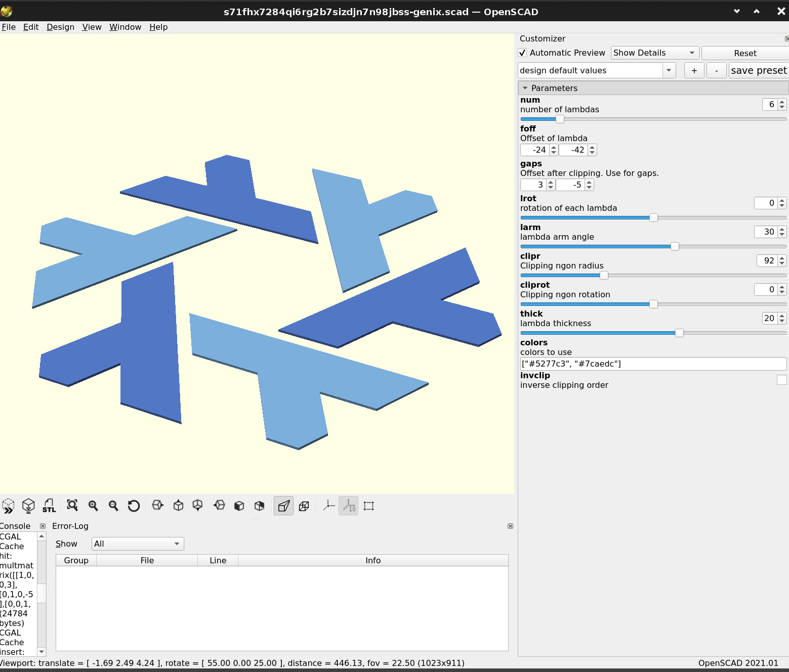

<!--
SPDX-License-Identifier: Unlicense
-->

Genix7000
===


**Fire all of your designers, Tweag, Serokell, Flox (and all other Nix-y companies)!**
</br>This is the ultimate, parametric and reproducible solution to all your branding problems!

It kinda went out of control, and I've made an openscad customizer, which supports a really wide range of Nix logos. Including original one.


### Install

Just [install Nix](https://zero-to-nix.com/concepts/nix-installer)

#### GUI

To start user interface

```bash
nix run github:cab404/genix7000 
```




#### CLI

To export as image without GUI

```bash
nix run github:cab404/genix7000#to-image -- mynix.png "\#cd3535" "\#cd6b35" "\#cdb835"
nix run github:cab404/genix7000#to-image -- mynix.svg
nix run github:cab404/genix7000#to-image -- mynix.mp4 --animation '{ thick: ($thick + $i / 2), rotation: ($rotation - $i) }' --thick 1
```

Flags:
- `--num <Int>`: Number of lambdas (default: 7)
- `--thick <Int>`: Lambda thickness (default: 20)
- `--imgsize <String>`: Image size in px (default: '860,860')
- `--offset <String>`: Offset of lambda (default: '-30,-40')
- `--gaps <String>`: Offset after clipping. Use for gaps. (default: '-2,-2')
- `--rotation <Int>`: Rotation of each lambda (default: 0)
- `--angle <Int>`: Lambda arm angle (default: 30)
- `--camera <String>`: Image camera (default: '0,0,480,0,0,0')
- `--clipr <Int>`: Clipping ngon radius (default: 90)
- `--cliprot <Int>`: Clipping ngon rotation (default: 90)
- `--clipinv <Boolean>`: Inverse clipping order (default: false)
- `--animation <String>`: video animation function (default: '{ rotation: ($rotation - $i) }')
- `--fps <Int>`: video frame rate (default: 15)
- `--duration <Int>`: video duration (default: 5)
- `-h, --help`: Display the help message for this command

Arguments:
- `outfile <string>`: Image filename, ie mynix.svg, mynix.mp4 (optional, default: 'mynix.png')
- `...colors <string>`: colors to use, ie "\#cd3535" "\#cd6b35" "\#cdb835"


### Developing

Run `nix run`, and you are good to go!

Also, you can try using customizer on Thingiverse, but it's baaaad.</br>
Thing on thingiverse: https://www.thingiverse.com/thing:5100695

*ehm, I just wanted to do a Nix logo, but a pentagram*
<!--
I literally spent 4 hours on polishing this thing
this joke went too far
I need help with my procastination
haaalp
